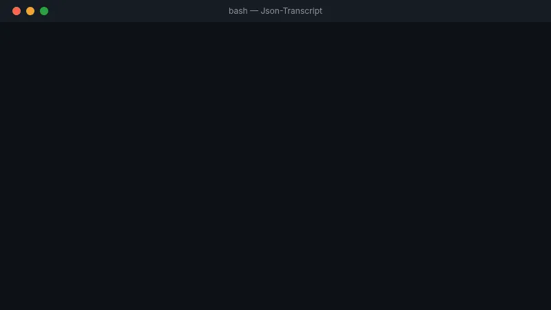

# Json-Transcript (JT)

> *Extract any tool. Run anywhere.*

[](https://github.com/tryboy869/json-transcript)
[](LICENSE)
[](https://tryboy869.github.io/daa)

**Json-Transcript** is a universal behavioral transcription framework.
It extracts the complete behavior of any software tool into a portable `.jts` file,
then runs it natively on any target runtime.



<video src="assets/json-transcript-en-720p.webm" width="100%" autoplay loop muted playsinline></video>

---

## How it works

```
Any Python package / GitHub repo / binary
           ↓  jt extract
      tool.jts
           ↓  jt translate --to rust
   tool_rust.jts
           ↓  jt run
  Native Rust execution
```

---

## Supported runtimes

| Package | Runtime | Docs |
|---------|---------|------|
| [JTP](JTP/) | Python 3.11+ | [README](JTP/README.md) |
| [JTJS](JTJS/) | JavaScript / TypeScript | [README](JTJS/README.md) |
| [JTJV](JTJV/) | Java 17+ | [README](JTJV/README.md) |
| [JTCS](JTCS/) | C# / .NET 8 | [README](JTCS/README.md) |
| [JTR](JTR/) | Rust 1.75+ | [README](JTR/README.md) |

---

## Quick start

```bash
# Install
curl -sSL https://raw.githubusercontent.com/tryboy869/json-transcript/main/jt.py -o jt.py

# Extract Flask
python3 jt.py extract --mode A --target flask --lang python

# Translate to Rust
python3 jt.py translate flask.jts --to rust

# Run
python3 jt.py run flask_rust.jts --port 8080
```

**Google Colab:**
```python
!curl -sSL https://raw.githubusercontent.com/tryboy869/json-transcript/main/jt.py -o jt.py
!python3 jt.py extract --mode A --target flask --lang python
!python3 jt.py translate flask.jts --to javascript
```

---

## Extraction modes

| Mode | Description | Example |
|------|-------------|---------|
| `A` | Installable package | `--mode A --target flask` |
| `C` | GitHub / source repo | `--mode C --target https://github.com/org/repo` |
| `D` | Opaque binary | `--mode D --target ./myapp.bin` |

---

## Documentation

- [Full docs](docs/DOCS.md) | [Docs FR](docs/DOCS.fr.md)
- [Contributing](CONTRIBUTING.md)
- [Changelog](CHANGELOG.md)

---

## Author

**Daouda Abdoul Anzize** — Computational Paradigm Designer

Cotonou, Benin -> Global Remote

[Portfolio](https://tryboy869.github.io/daa) · [Twitter](https://twitter.com/Nexusstudio100) · [LinkedIn](https://linkedin.com/in/anzize-adeleke-daouda)

> *"I don't build apps. I build the clay others use to build apps."*
