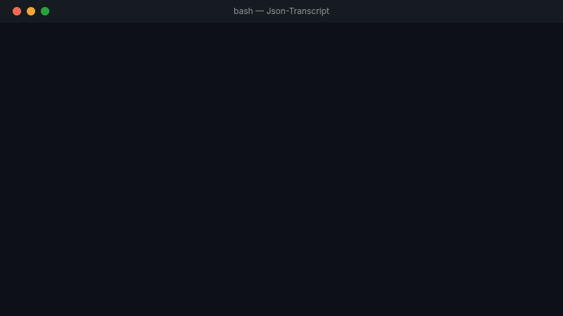

<div align="center">



[](assets/json-transcript-en-720p.webm)

# Json-Transcript (JT)

**Universal behavioral transcription framework**

*Extract any tool. Run anywhere.*

[](https://github.com/Tryboy869/json-transcript/releases)
[](LICENSE)
[](JTP/)
[](JTJS/)
[](JTJV/)
[](JTCS/)
[](JTR/)

</div>

---

## What is Json-Transcript?

Json-Transcript extracts the **complete behavioral graph** of any software tool — its static structure + its live execution patterns — into a single portable `.jts` file. That file is then executed natively on any target runtime.

No transpilation. No simulation. **Behavioral assimilation.**

```
Any Python package / GitHub repo / opaque binary
              ↓   jt extract
         tool.jts   ←── universal behavioral graph
              ↓   jt translate --to rust
       tool_rust.jts
              ↓   jt run
    Native execution on Rust — zero Python dependency
```

---

## Why Json-Transcript?

| Problem | Solution |
|---------|----------|
| scikit-learn has no native Rust equivalent | Extract sklearn → run on Rust runtime |
| A 10-year-old Python codebase needs to become Go | Extract it → translate → run |
| A proprietary binary needs to be ported | Observe its I/O → extract → replicate |
| You want LangChain in TypeScript natively | Extract → translate → done |

---

## Supported Runtimes — v1.0.1-beta

| Package | Runtime | Install |
|---------|---------|---------|
| **JTP** | Python 3.10+ | `jt install JTP` |
| **JTJS** | JavaScript / TypeScript (Node 20+) | `jt install JTJS` |
| **JTJV** | Java 17+ | `jt install JTJV` |
| **JTCS** | C# / .NET 8 | `jt install JTCS` |
| **JTR** | Rust 1.75+ | `jt install JTR` |

---

## Installation

**Terminal / SSH:**
```bash
curl -sSL https://raw.githubusercontent.com/Tryboy869/json-transcript/main/jt.py -o jt.py
python3 jt.py --help
```

**Google Colab:**
```python
!curl -sSL https://raw.githubusercontent.com/Tryboy869/json-transcript/main/jt.py -o jt.py
!python3 jt.py --help
```

**Docker (all runtimes):**
```bash
docker pull ghcr.io/tryboy869/json-transcript:latest
docker run -it json-transcript jt extract --mode A --target flask --lang python
```

---

## Extraction Modes

| Mode | Description | Use case |
|------|-------------|----------|
| `A` — Package | `pip install` + static AST + dynamic hooks | Any published Python package |
| `C` — Source | GitHub repo or local folder | Open source projects |
| `D` — Binary | Dynamic I/O observation only | Proprietary / closed-source tools |

---

## Commands

```bash
# Extract a Python package (mode A)
python3 jt.py extract --mode A --target flask --lang python

# Extract from GitHub (mode C)
python3 jt.py extract --mode C --target https://github.com/pallets/flask --lang python

# Extract a binary (mode D)
python3 jt.py extract --mode D --target ./myapp.bin

# Translate to a target runtime
python3 jt.py translate flask.jts --to rust
python3 jt.py translate flask.jts --to javascript
python3 jt.py translate flask.jts --to java
python3 jt.py translate flask.jts --to csharp

# Run the graph on its runtime (via Docker)
python3 jt.py run flask_rust.jts --port 8080

# Extract + translate in one command
python3 jt.py convert --from python --to rust --target flask

# Validate: compare reference vs translated
python3 jt.py validate flask.jts flask_rust.jts

# Install a runtime package
python3 jt.py install JTR
```

---

## The .jts Format

A `.jts` file is a **portable behavioral graph** — pure JSON:

```json
{
  "meta": {
    "source_pkg":     "flask",
    "source_lang":    "python",
    "target_runtime": "rust",
    "extractor":      "Json-Transcript v1.0.1-beta"
  },
  "static": {
    "app.py": {
      "imports": ["werkzeug", "click"],
      "exports": [{ "kind": "class", "name": "Flask", "methods": [...] }],
      "lines": 612
    }
  },
  "dynamic": {
    "edges": [
      {
        "edge":     "Flask.dispatch_request",
        "transfer": {
          "domain":       "RESEAU",
          "confidence":   1.0,
          "input_shapes": [{ "method": "http_method:GET", "path": "url_path" }],
          "output_shapes": [{ "class": "Response", "attrs": { "status_code": "int" } }]
        }
      }
    ],
    "call_sequence": ["Flask.add_url_rule", "Flask.dispatch_request", "Flask.make_response"]
  },
  "runtime_interface": {
    "routes": [...],
    "hooks":  { "before_request": true, "after_request": true },
    "domain_map": { "Flask.dispatch_request": "RESEAU" }
  }
}
```

---

## Domain Detection — No LLM

Json-Transcript classifies every function by **structural signature similarity** — no AI, no manual rules, no mapping:

| Domain | Key signals detected | Example |
|--------|---------------------|---------|
| `RESEAU` | `method`, `path`, `status`, `headers`, `url` | Flask routes, HTTP handlers |
| `COMPUTE` | `tensor`, `matrix`, `op`, `transform`, `fit` | sklearn, numpy, PyTorch |
| `DATA` | `query`, `session`, `db`, `cache`, `key` | SQLAlchemy, Redis, MongoDB |
| `CONFIG` | `hook`, `middleware`, `register`, `blueprint` | App config, decorators |

Each domain maps to **runtime-specific patterns** during translation:

```
RESEAU + rust   →  axum handler
RESEAU + java   →  @GetMapping controller  
COMPUTE + js    →  async function with typed arrays
DATA + csharp   →  ISession / DbContext
```

---

## Validated Results

| Source | Target | Tests | Status |
|--------|--------|-------|--------|
| Flask (Python) | Python runtime | 11/11 | ✅ |
| Flask (Python) | Node.js runtime | 11/11 | ✅ |
| SmolLM-360M (Python) | Rust (Axum) | Token match | ✅ diff < 1e-4 |
| scikit-learn (Python) | JS / Java / Rust / C# | 4×4/4 | ✅ |

---

## Real-world Use Cases

**1. Legacy migration**
```bash
# 30 years of COBOL logic → modern Java
jt extract --mode D --target ./legacy.bin
jt translate legacy.jts --to java
jt run legacy_java.jts
```

**2. ML inference without Python**
```bash
# scikit-learn pipeline → Rust microservice
jt convert --from python --to rust --target scikit-learn
jt run scikit-learn_rust.jts
```

**3. Framework portability**
```bash
# Flask API → Express (Node.js)
jt convert --from python --to javascript --target flask
jt run flask_javascript.jts --port 3000
```

**4. Proprietary binary replication**
```bash
# Closed-source tool, no access to source
jt extract --mode D --target ./proprietary_tool.bin
jt translate proprietary_tool.jts --to csharp
```

---

## Runtime Packages

### JTP — Python
```bash
python3 jt.py extract --mode A --target <pkg> --lang python
python3 jt.py translate <file.jts> --to python
```

### JTJS — JavaScript / TypeScript
```bash
python3 jt.py extract --mode A --target <pkg> --lang javascript
python3 jt.py translate <file.jts> --to javascript
python3 jt.py translate <file.jts> --to typescript
```

### JTJV — Java
```bash
python3 jt.py extract --mode A --target <pkg> --lang java
python3 jt.py translate <file.jts> --to java
```

### JTCS — C# / .NET
```bash
python3 jt.py translate <file.jts> --to csharp
```

### JTR — Rust
```bash
python3 jt.py translate <file.jts> --to rust
```

---

## Architecture

```
json-transcript/
├── jt.py                  ← CLI entry point (single file, no install needed)
├── jts.json               ← Central orchestrator — JSON controls everything
├── Dockerfile             ← All 5 runtimes in one image
├── JTP/  JTJS/  JTJV/  JTCS/  JTR/   ← Runtime packages
│   └── README.md + README.fr.md + <pkg>.json
└── assets/
    ├── demo.gif
    ├── json-transcript-en-720p.webm
    └── json-transcript-fr-720p.webm
```

**The philosophy:** `jts.json` is the orchestrator. Not shell scripts, not Makefiles — JSON orchestrates JSON.

---

## Changelog

See [CHANGELOG.md](CHANGELOG.md) for full history.

**v1.0.1-beta** — 2026-03-13
- Fix: import alias map (`scikit-learn` → `sklearn`, `pillow` → `PIL`, etc.)
- Fix: extraction mode A indentation bug in `cmd_extract`
- Improvement: dynamic extraction now uses resolved `import_name`
- Docs: README rewritten — full documentation inline, no separate docs/ folder
- Docs: video assets properly linked (EN/FR)
- Assets: demo.gif + webm videos integrated

**v1.0.0-beta** — 2026-03-13
- Initial release
- Hybrid extractor: static AST + dynamic behavioral hooks
- Domain detection via structural signature similarity (no LLM)
- Auto-translator: Python → JS / TS / Java / C# / Rust
- CLI: extract, translate, run, convert, validate, install
- Runtime packages: JTP, JTJS, JTJV, JTCS, JTR
- Docker image with all 5 runtimes
- Extraction modes: A (package), C (source), D (binary)
- Validated: Flask 11/11 Python + 11/11 Node.js
- Validated: SmolLM-360M Python → Rust token match (diff < 1e-4)

---

## Contributing

1. Fork → `git checkout -b feature/my-feature`
2. Make changes + add tests
3. Submit Pull Request

To add a new runtime: create `JT<X>/` folder, add `jt<x>.json` + READMEs, add translation patterns to `RUNTIME_PATTERNS` in `jt.py`.

Issues: open a GitHub issue with JT version, command used, target tool, error output.

---

## License

MIT — Copyright (c) 2026 Daouda Abdoul Anzize

---

<div align="center">

**Daouda Abdoul Anzize** — Computational Paradigm Designer

Cotonou, Benin → Global Remote

[Portfolio](https://tryboy869.github.io/daa) · [Twitter](https://twitter.com/Nexusstudio100) · [LinkedIn](https://linkedin.com/in/anzize-adeleke-daouda)

*"I don't build apps. I build the clay others use to build apps."*

</div>
